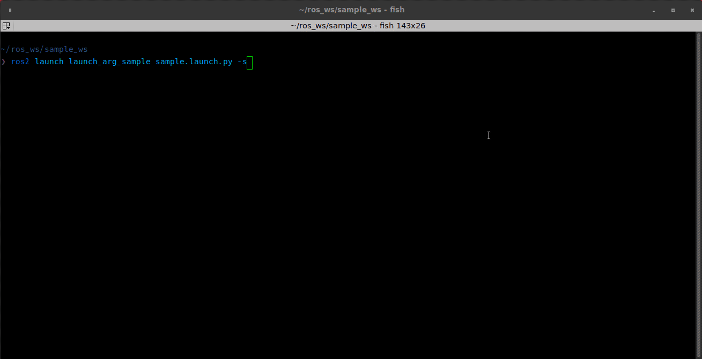

# launch arg sample
This is demo package to describe ~~launch argument bug~~ how to set a launch argument that includes character colon.

## problem
If a string argement includes colon <span style="color: red; ">:</span> , launch process will die. 



## demo command

```shell
# launch process will die
ros2 launch launch_arg_sample sample.launch.py compare_str:="Hello World:"
```

```shell
# working
ros2 launch launch_arg_sample sample.launch.py compare_str:="Hello World"
```

## Solution
Enclose string in single quotes.

```shell
# working
ros2 launch launch_arg_sample sample.launch.py compare_str:="'Hello World:'"
```

## Why
https://github.com/ros2/launch/issues/508
